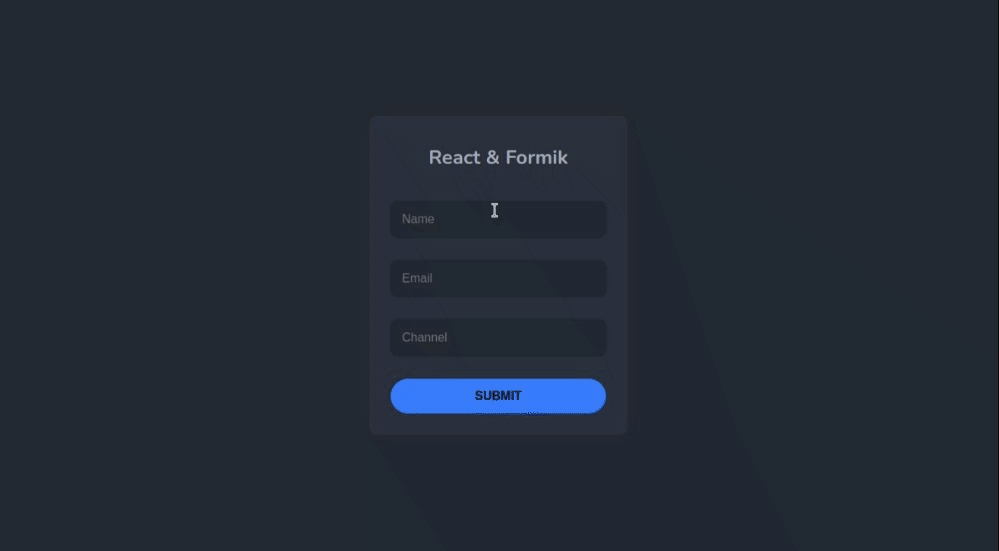

# LarnU Fullstack Bootcamp

## INTRO TO REACT FORMIK

REACT FORM USING FORMIK LIBRARY
React Form using useFormik hook. Simple and
practical use case for our day to day, using our own validation
rules. This project uses, javascript and vanilla css.

- npm i
- npm run dev

